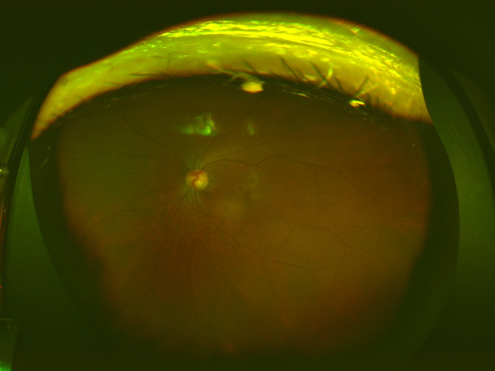
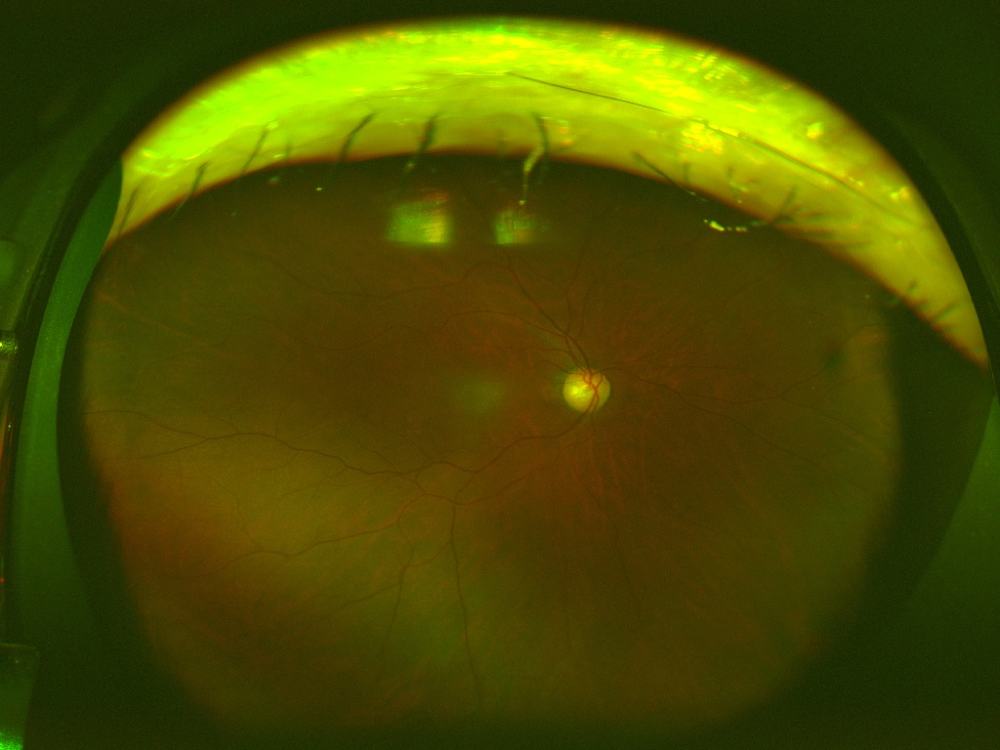
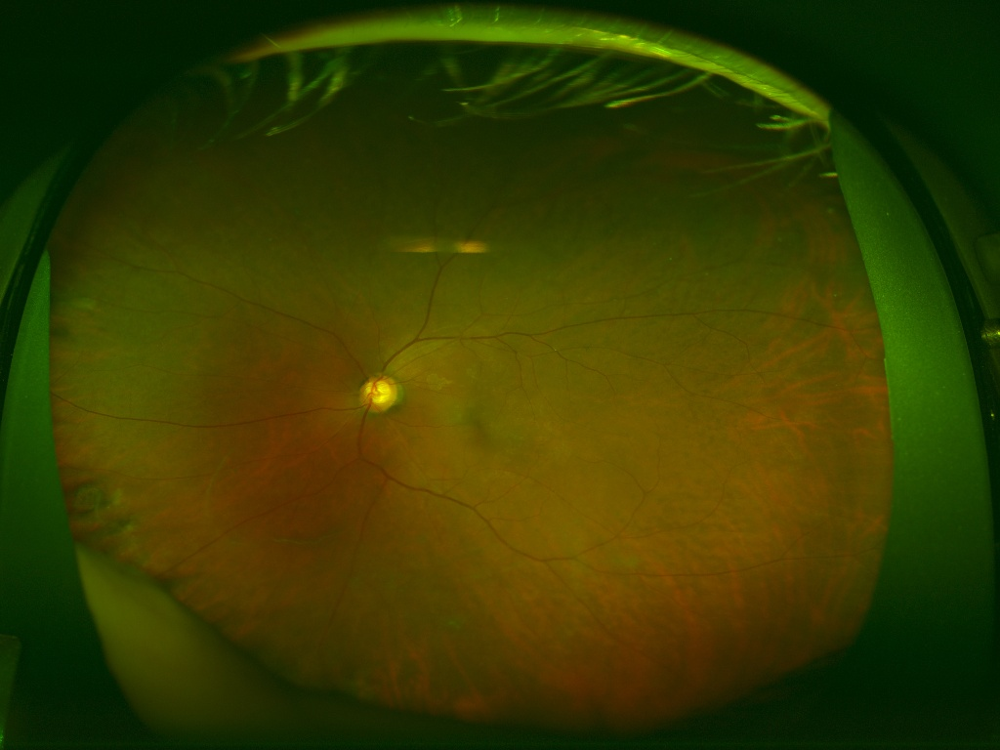
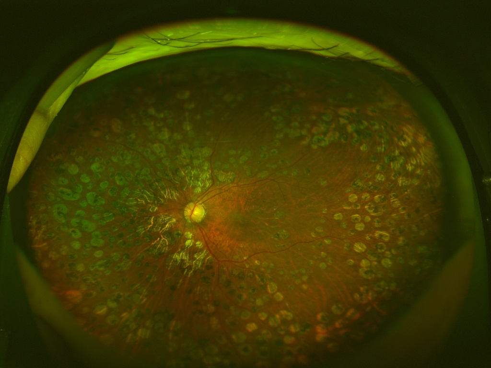
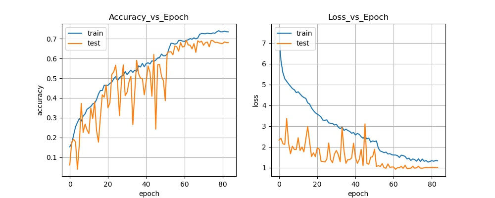

# 広角眼底画像データセットで画像分類
広角眼底画像データセットを対象に、単純な10層CNNで画像分類する。  
[Qiita解説記事](https://qiita.com/burokoron/items/8c011c219b7545c50355)
  
  # 1. はじめに
　本記事では入門向けとして、TensorFlow2.0を使用して、とりあえずDeep Learningで画像分類を行うことを目標とします。画像データセットはMNISTとかだと面白くないので、ツカザキ病院により公開されている広角眼底画像データセット[1]を使用します。また、ネットワークは単純な10層CNNとします。

# 2. 環境
- PCスペック
  - CPU: Intel Core i9-9900K
  - RAM: 16GB
  - GPU: NVIDIA GeForce GTX 1080 Ti
- ライブラリ
  - Python: 3.7.4
  - matplotlib: 3.1.1
  - pandas: 0.25.1
  - tqdm: 4.31.1
  - pillow: 6.1.0
  - scikit-learn: 0.21.3
  - tensorflow-gpu: 2.0.0

# 3. 広角眼底画像データセット
　ツカザキ病院により公開された13047枚(5389人8588眼)の広角眼底データセット。下記リンクより画像と疾患ラベルが対応付けられたcsvファイルをダウンロードできます。  
Tsukazaki Optos Public Project  
https://tsukazaki-ai.github.io/optos_dataset/

疾患ラベルの内訳は以下の通りです。

|ラベル|疾患|枚数|
|:--:|:--:|:--:|
|AMD|加齢黄斑変性|413|
|RVO|網膜静脈閉塞症|778|
|Gla|緑内障|2619|
|MH|黄斑円孔|222|
|DR|糖尿病網膜症|3323|
|RD|網膜剥離|974|
|RP|網膜色素変性症|258|
|AO|動脈閉塞|21|
|DM|糖尿病|3895|

表の枚数の合計と画像の枚数が違っていてアレ？と思った方もいると思いますので、実際のcsvファイルを少し見てみます。

|filename|age|sex|LR|AMD|RVO|Gla|MH|DR|RD|RP|AO|DM|
|:--:|:--:|:--:|:--:|:--:|:--:|:--:|:--:|:--:|:--:|:--:|:--:|:--:|
|000000_00.jpg|78|M|L|0|0|0|0|0|0|0|0|0|
|000000_01.jpg|78|M|R|0|0|0|0|0|0|0|0|0|
|─|─|─|─|─|─|─|─|─|─|─|─|─|
|000001_02.jpg|69|M|L|0|0|1|0|0|0|0|0|0|
|─|─|─|─|─|─|─|─|─|─|─|─|─|
|000011_01.jpg|70|F|L|0|0|0|0|1|0|0|0|1|

このように1つの画像に対して複数のラベル(合併症)があるマルチラベル問題となっています。ラベルがついていないのは病気でない画像で全部で4364枚あります。また、以下に画像サンプルを示します。

<details><summary>グロテスクな画像が含まれます</summary><div>
  
  
000000_00.jpg  
  
000000_01.jpg  
  
000001_02.jpg  
  
000011_01.jpg  

</div></details>

データ数の不均衡あり、マルチラベルありとなかなか~~めんどくさ~~実践的なデータセットとなっていますが、本記事ではマルチラベルでない画像のみで、クラス数の多いものだけを使用して簡単にクラス分類を行います。

# 4. データ分割
　まずはマルチラベルではない画像だけをcsvファイルから抽出します。ただし、DRの画像はDMもあるのでDRとDMが同時に発症している画像も抽出します。ただし、画像枚数がそれぞれ3枚、11枚しかないDR、AOは使用しないこととしました。また、ラベルが部分的に重複しているDR+DMが3113枚、DMが530枚だったので、今回は数が少ない方のDMも使用しないこととしました。さらに、あとで処理しすいようにcsvファイルの形式も変更しました。

<details><summary>マルチラベルではない画像を抽出しcsvファイルにまとめるコード</summary><div>

```py
from collections import defaultdict
import pandas as pd


# 広角眼底データセットのcsvファイルを読み込む
df = pd.read_csv('data.csv')

dataset = defaultdict(list)

for i in range(len(df)):
    # 付いているラベルを文字化する
    labels = ''
    if df.iloc[i]['AMD'] == 1:
        labels += '_AMD'
    if df.iloc[i]['RVO'] == 1:
        labels += '_RVO'
    if df.iloc[i]['Gla'] == 1:
        labels += '_Gla'
    if df.iloc[i]['MH'] == 1:
        labels += '_MH'
    if df.iloc[i]['DR'] == 1:
        labels += '_DR'
    if df.iloc[i]['RD'] == 1:
        labels += '_RD'
    if df.iloc[i]['RP'] == 1:
        labels += '_RP'
    if df.iloc[i]['AO'] == 1:
        labels += '_AO'
    if df.iloc[i]['DM'] == 1:
        labels += '_DM'
    if labels == '':
        labels = 'Normal'
    else:
        labels = labels[1:]

    # マルチラベルでない(DR+DMは除く)画像および
    # 数の少ないDR、DMおよび
    # ラベルが重複するがDR+DMより数の少ないDM意外の画像を抽出する
    if '_' not in labels or labels == 'DR_DM':
        if labels not in ('DR', 'AO', 'DM'):
            dataset['filename'].append(df.iloc[i]['filename'])
            dataset['id'].append(df.iloc[i]['filename'].split('_')[0].split('.')[0])
            dataset['label'].append(labels)

# csvファイルで保存
dataset = pd.DataFrame(dataset)
dataset.to_csv('dataset.csv', index=False)
```

</div></details>

上記コードにより以下のようなcsvファイルを作成しました。画像は{連番ID}_{連番}.jpgという法則で名前付けられているので連番IDをidとしています。

|filename|id|label|
|:--:|:--:|:--:|
|000000_00.jpg|0|Normal|
|000000_01.jpg|0|Normal|
|─|─|─|
|000001_02.jpg|1|Gla|
|─|─|─|
|000011_01.jpg|11|DR_DM|

抽出の結果、分類クラスと画像枚数の内訳は以下のようになりました。Normalは病気でない画像です。

|ラベル|枚数|
|:--:|:--:|
|Normal|4364|
|Gla|2293|
|AMD|375|
|RP|247|
|DR_DM|3113|
|RD|883|
|RVO|537|
|MH|161|

　次に画像のデータ分割を行います。データセットは13047枚(5389人8588眼)なので、同一人物や同一眼の画像が含まれています。同一人物や同一眼の画像には似たような特徴・ラベルが含まれているので、データリークの原因になり得ます。したがって、同一人物が学習データとテストデータにまたがって存在してしまわないように分割を行います。さらに学習データとテストデータの各クラス内訳の比率がだいたい同じになるようにします。
　今回は、学習データ60%、検証データ20%、テストデータ20%としました。

[グループ層化K分割するコード](https://gist.github.com/burokoron/54cb382d26c626fea8ca60d8c5d4c7bc)

# 5. モデル構築&学習
 まずは使用するライブラリをインポートします。

```py
import matplotlib.pyplot as plt
import pandas as pd
from tensorflow.keras.callbacks import ModelCheckpoint, ReduceLROnPlateau
from tensorflow.keras.callbacks import EarlyStopping
from tensorflow.keras.preprocessing.image import ImageDataGenerator
from tensorflow.keras.models import Model
from tensorflow.keras.layers import GlobalAveragePooling2D, Input, MaxPool2D
from tensorflow.keras.layers import Conv2D, Dense, BatchNormalization, Activation
from tensorflow.keras.optimizers import Adam
```

次にパラメータ等を記述します。`label_list`はライブラリの都合でabc順になるようにしています。

```py
directory = 'img' # 画像が保存されているフォルダ
df_train = pd.read_csv('train.csv') # 学習データの情報がかかれたDataFrame
df_validation = pd.read_csv('val.csv') # 検証データの情報がかかれたDataFrame
label_list = ['AMD', 'DR_DM', 'Gla', 'MH', 'Normal', 'RD', 'RP', 'RVO'] # ラベル名
image_size = (224, 224) # 入力画像サイズ
classes = len(label_list) # 分類クラス数
batch_size = 32 # バッチサイズ
epochs = 300 # エポック数
loss = 'categorical_crossentropy' # 損失関数
optimizer = Adam(lr=0.001, amsgrad=True) # 最適化関数
metrics = 'accuracy' # 評価方法
# ImageDataGenerator画像増幅のパラメータ
aug_params = {'rotation_range': 5,
              'width_shift_range': 0.05,
              'height_shift_range': 0.05,
              'shear_range': 0.1,
              'zoom_range': 0.05,
              'horizontal_flip': True,
              'vertical_flip': True}
```

学習時のコールバック処理として以下を適用します。

```py
# val_lossが最小になったときのみmodelを保存
mc_cb = ModelCheckpoint('model_weights.h5',
                        monitor='val_loss', verbose=1,
                        save_best_only=True, mode='min')
# 学習が停滞したとき、学習率を0.2倍に
rl_cb = ReduceLROnPlateau(monitor='loss', factor=0.2, patience=3,
                          verbose=1, mode='auto',
                          min_delta=0.0001, cooldown=0, min_lr=0)
# 学習が進まなくなったら、強制的に学習終了
es_cb = EarlyStopping(monitor='loss', min_delta=0,
                      patience=5, verbose=1, mode='auto')
```

各クラスのデータ数が不均衡なので、データ数の少ないクラスを間違えた場合はロスが大きくなるようにします。

```py
# データの数に合わせて損失の重みを調整
weight_balanced = {}
for i, label in enumerate(label_list):
    weight_balanced[i] = (df_train['label'] == label).sum()
max_count = max(weight_balanced.values())
for label in weight_balanced:
    weight_balanced[label] = max_count / weight_balanced[label]
print(weight_balanced)
```

学習データと検証データのジェネレータを生成します。データ拡張にはImageDataGeneratorを使用し、flow_from_dataframeでDataFrameから画像を読み込みます。`label_list`をabc順にしたのはflow_from_dataframeで画像を読み込むと文字列のabc順にクラスを割り当てるので、クラス番号とラベル名の対応をわかるようにするためです。一応あとで対応を調べることもできますが、めんどくさいので……。

```py
# ジェネレータの生成
## 学習データのジェネレータ
datagen = ImageDataGenerator(rescale=1./255, **aug_params)
train_generator = datagen.flow_from_dataframe(
    dataframe=df_train, directory=directory,
    x_col='filename', y_col='label',
    target_size=image_size, class_mode='categorical',
    classes=label_list,
    batch_size=batch_size)
step_size_train = train_generator.n // train_generator.batch_size
## 検証データのジェネレータ
datagen = ImageDataGenerator(rescale=1./255)
validation_generator = datagen.flow_from_dataframe(
    dataframe=df_validation, directory=directory,
    x_col='filename', y_col='label',
    target_size=image_size, class_mode='categorical',
    classes=label_list,
    batch_size=batch_size)
step_size_validation = validation_generator.n // validation_generator.batch_size
```

10層の単純なCNNを構築します。

```py
# 10層CNNの構築
def cnn(input_shape, classes):
    # 入力層
    inputs = Input(shape=(input_shape[0], input_shape[1], 3))

    # 1層目
    x = Conv2D(32, (3, 3), padding='same', kernel_initializer='he_normal')(inputs)
    x = BatchNormalization()(x)
    x = Activation('relu')(x)
    x = MaxPool2D(pool_size=(2, 2))(x)

    # 2層目
    x = Conv2D(64, (3, 3), strides=(1, 1), padding='same', kernel_initializer='he_normal')(x)
    x = BatchNormalization()(x)
    x = Activation('relu')(x)
    x = MaxPool2D(pool_size=(2, 2))(x)

    # 3層目
    x = Conv2D(128, (3, 3), strides=(1, 1), padding='same', kernel_initializer='he_normal')(x)
    x = BatchNormalization()(x)
    x = Activation('relu')(x)
    x = MaxPool2D(pool_size=(2, 2))(x)

    # 4層目
    x = Conv2D(256, (3, 3), strides=(1, 1), padding='same', kernel_initializer='he_normal')(x)
    x = BatchNormalization()(x)
    x = Activation('relu')(x)
    x = MaxPool2D(pool_size=(2, 2))(x)

    # 5、6層目
    x = Conv2D(512, (3, 3), strides=(1, 1), padding='same', kernel_initializer='he_normal')(x)
    x = BatchNormalization()(x)
    x = Activation('relu')(x)
    x = Conv2D(512, (3, 3), strides=(1, 1), padding='same', kernel_initializer='he_normal')(x)
    x = BatchNormalization()(x)
    x = Activation('relu')(x)
    x = MaxPool2D(pool_size=(2, 2))(x)

    # 7、8層目
    x = Conv2D(1024, (3, 3), strides=(1, 1), padding='same', kernel_initializer='he_normal')(x)
    x = BatchNormalization()(x)
    x = Activation('relu')(x)
    x = Conv2D(1024, (3, 3), strides=(1, 1), padding='same', kernel_initializer='he_normal')(x)
    x = BatchNormalization()(x)
    x = Activation('relu')(x)
    x = GlobalAveragePooling2D()(x)

    # 9、10層目
    x = Dense(256, kernel_initializer='he_normal')(x)
    x = Dense(classes, kernel_initializer='he_normal')(x)
    outputs = Activation('softmax')(x)


    return Model(inputs=inputs, outputs=outputs)

# ネットワーク構築
model = cnn(image_size, classes)
model.summary()
model.compile(loss=loss, optimizer=optimizer, metrics=[metrics])
```

ネットワークを学習します。

```py
# 学習
history = model.fit_generator(
    train_generator, steps_per_epoch=step_size_train,
    epochs=epochs, verbose=1, callbacks=[mc_cb, rl_cb, es_cb],
    validation_data=validation_generator,
    validation_steps=step_size_validation,
    class_weight=weight_balanced,
    workers=3)
```

最後に、学習曲線のグラフを画像で保存します。

```py
# 学習曲線のグラフを描き保存する
def plot_history(history):
    fig, (axL, axR) = plt.subplots(ncols=2, figsize=(10, 4))

    # [左側] metricsについてのグラフ
    L_title = 'Accuracy_vs_Epoch'
    axL.plot(history.history['accuracy'])
    axL.plot(history.history['val_accuracy'])
    axL.grid(True)
    axL.set_title(L_title)
    axL.set_ylabel('accuracy')
    axL.set_xlabel('epoch')
    axL.legend(['train', 'test'], loc='upper left')

    # [右側] lossについてのグラフ
    R_title = "Loss_vs_Epoch"
    axR.plot(history.history['loss'])
    axR.plot(history.history['val_loss'])
    axR.grid(True)
    axR.set_title(R_title)
    axR.set_ylabel('loss')
    axR.set_xlabel('epoch')
    axR.legend(['train', 'test'], loc='upper left')

    # グラフを画像として保存
    fig.savefig('history.jpg')
    plt.close()

# 学習曲線の保存
plot_history(history)
```

学習結果は以下のようになりました。



# 6. 評価
　評価は不均衡データなのでF1 Scoreで評価します。
　まずは、先ほど学習したモデルでテストデータの推論を行います。

追加のimport。

```py
import numpy as np
from PIL import Image
from sklearn.metrics import classification_report
from tqdm import tqdm
```

パラメータを記述。今回はtestのcsvファイルを読み込みます。

```py
directory = 'img' # 画像が保存されているフォルダ
df_test = pd.read_csv('test.csv') # テストデータの情報がかかれたDataFrame
label_list = ['AMD', 'DR_DM', 'Gla', 'MH', 'Normal', 'RD', 'RP', 'RVO'] # ラベル名
image_size = (224, 224) # 入力画像サイズ
classes = len(label_list) # 分類クラス数
```

学習したネットワークを構築し、先ほど学習した重みを読み込みます。

```py
# ネットワーク構築&学習済み重みの読み込み
model = cnn(image_size, classes)
model.load_weights('model_weights.h5')
```

学習時と同じ条件になるように画像を読み込み&変換して推論を行います。

```py
# 推論
X = df_test['filename'].values
y_true = list(map(lambda x: label_list.index(x), df_test['label'].values))
y_pred = []
for file in tqdm(X, desc='pred'):
    # 学習時と同じ条件になるように画像をリサイズ&変換
    img = Image.open(f'{directory}/{file}')
    img = img.resize(image_size, Image.LANCZOS)
    img = np.array(img, dtype=np.float32)
    img *= 1./255
    img = np.expand_dims(img, axis=0)

    y_pred.append(np.argmax(model.predict(img)[0]))
```

scikit-learnを用いてF1 Scoreを計算します。

```py
# 評価
print(classification_report(y_true, y_pred, target_names=label_list))
```

以下、評価結果です。案の定、データ数の少ないAMDとMHはスコアが低いですね。

```
              precision    recall  f1-score   support

         AMD       0.17      0.67      0.27        75
       DR_DM       0.72      0.75      0.73       620
         Gla       0.76      0.69      0.72       459
          MH       0.09      0.34      0.14        32
      Normal       0.81      0.50      0.62       871
          RD       0.87      0.79      0.83       176
          RP       0.81      0.86      0.83        50
         RVO       0.45      0.65      0.53       107

    accuracy                           0.64      2390
   macro avg       0.58      0.66      0.59      2390
weighted avg       0.73      0.64      0.67      2390
```

# 7. まとめ
　本記事では、10層の単純なCNNを用いてツカザキ病院により公開された広角眼底データセットの画像分類を行いました。今後はこの結果をベースとしてネットワーク構造やデータ拡張方法などの最新の手法を取り入れながら、性能の改善を行っていこうと思います。

# 参考文献
[1] [Tsukazaki Optos Public Project](https://tsukazaki-ai.github.io/optos_dataset/)
